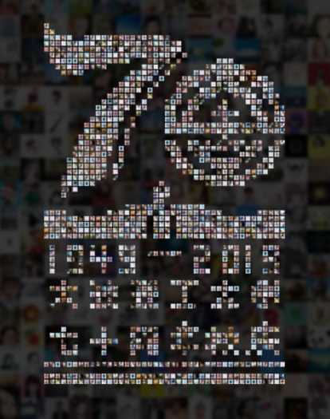
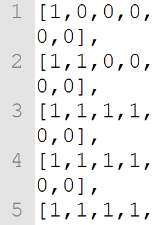
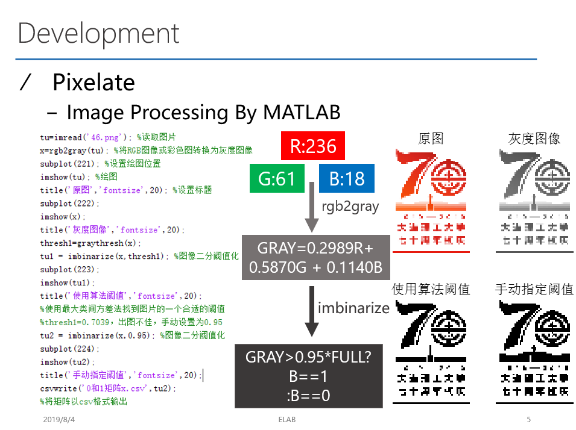
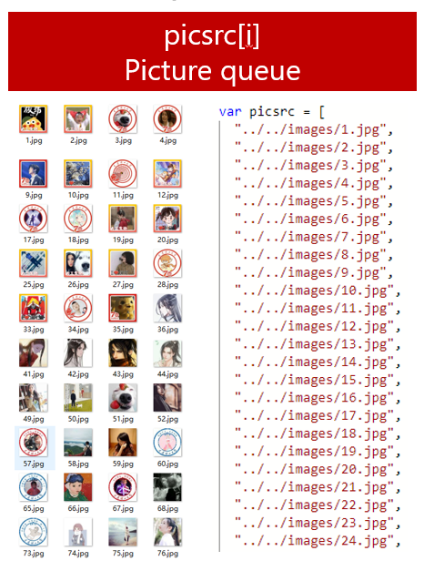
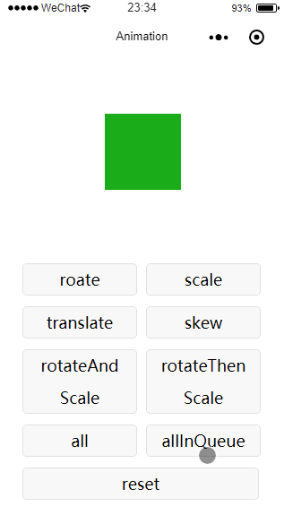
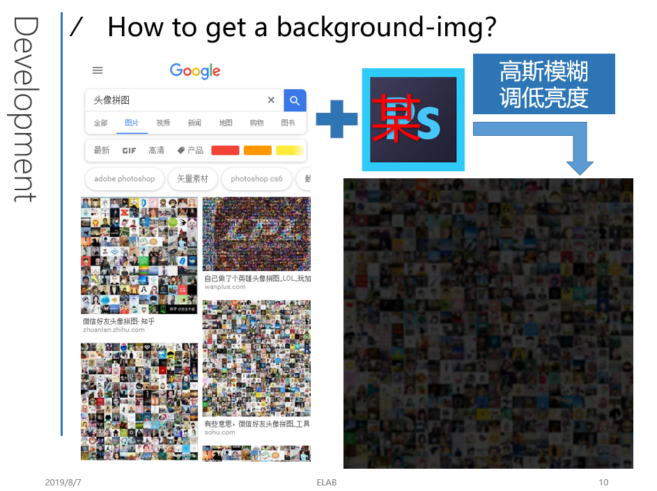
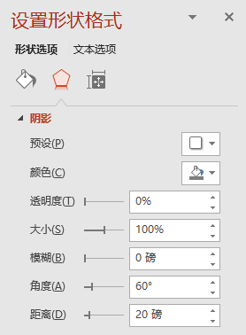
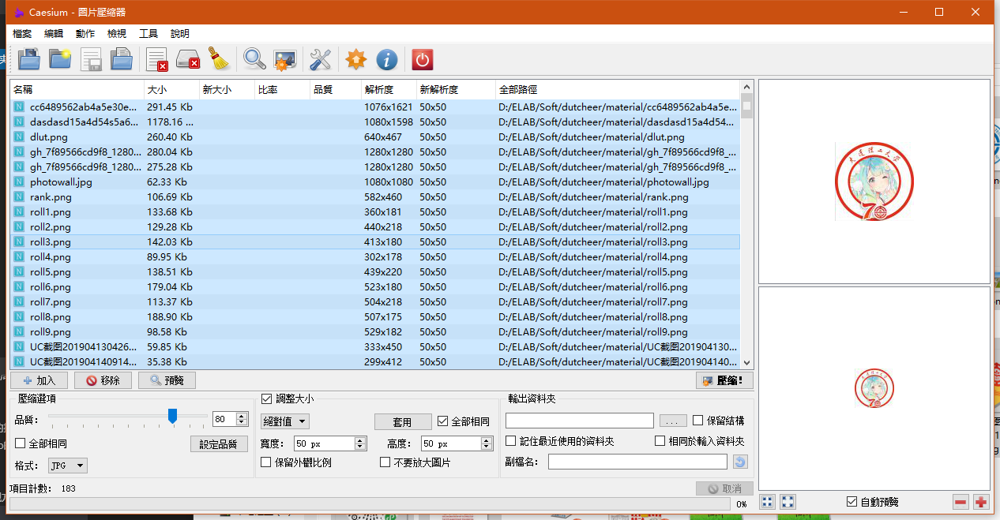
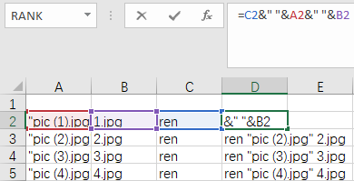

# 大连理工大学 70 周年校庆系列小程序之——相聚大工

**微信小程序** **大连理工大学70周年校庆** **头像拼图** **马赛克拼图** **照片墙** **爆炸动画** **卷轴动画** **animation** **图像二值化** **MATLAB** **冬奥有我**


# 1. 项目简介

:warning:  **由于服务器迁移，现小程序已无法正常使用，运行效果请参考文中图片**


这是于:clock8:2019 年 6 月 15 日（建校 70 周年纪念日）由“大连理工大学”官方微信公众号推送的**相聚大工**小程序，作为一个宣传性质的小程序，在发布后 3 天内获得了 2.1 万用户并被广泛转发到朋友圈，较好地完成了既定的任务:tada:


# 2. 页面一览

## 2.1. 欢迎页


早期版本的首页是左面这个推拉门动画:door::point_left::point_right::door:（由于“分裂大工”被捕，替换为右侧这个简单但更实用的点击 ->消失动画）

## 2.2. 历史卷轴


一个纵向的卷轴:scroll: 动画，用于展示大工的重要历史时刻并**为动画渲染赢得时间**:stuck_out_tongue_winking_eye:

## 2.3. 头像拼图


此小程序的核心部分，一个将大量头像拼成校庆标志的动画，这些头像会从左往右进行拼接 (当然，是可调的)，用户的头像会被明显的放大以增强其临场感:sunglasses:

点击“查看我的头像位置”按钮将能放大用户头像并将其点亮:sparkles:，而后按钮将变换样式，此时点击将缩小头像，但闪光效果不消失

点击“生成分享图”字样将根据用户信息生成如下样式的图片：


:warning: 这里有一个人生的经验，虽然这个功能是生成图片分享到朋友圈，但如果写上“分享到朋友圈”字样，将会被判定为“诱导分享”，无法通过审核；这个问题导致之前的校史答题小程序屡次无法通过审核，最后删掉了这个按钮才通过 :anger:；所以我们要善于伪装起来骗过腾讯的可编程过滤器

---

<!-- TOC -->

# 目录

- [1. 项目简介](#1-项目简介)
- [2. 页面一览](#2-页面一览)
    - [2.1. 欢迎页](#21-欢迎页)
    - [2.2. 历史卷轴](#22-历史卷轴)
    - [2.3. 头像拼图](#23-头像拼图)
- [2. 使用前的准备](#2-使用前的准备)
- [3. 主要功能模块实现方法](#3-主要功能实现方法)
    - [3.1. 静态拼图](#31-静态拼图)
    - [3.2. 拼图动画](#32-拼图动画)
        - [3.2.1. 扩散动画](#321-扩散动画)
        - [3.2.2. 用户头像的特殊处理](#322-用户头像的特殊处理)
        - [3.2.3. 聚集动画](#323-聚集动画)
        - [3.2.4. 动画合成](#324-动画合成)
    - [2.2. 头像的点亮](#22-头像的点亮)
    - [2.3. 历史卷轴:scroll:](#23-历史卷轴scroll)
    - [2.4. 推拉开门动画](#24-推拉开门动画)
    - [2.5. 分享图的生成](#25-分享图的生成)
- [2. 其他事项](#2-其他事项)
    - [2.1. 背景图的制作和使用](#21-背景图的制作和使用)
    - [2.2. 小程序 logo 的极速制作](#22-小程序-logo-的极速制作)
    - [2.3. 头像图片的批量处理](#23-头像图片的批量处理)
- [2. 后记](#2-后记)
- [3. 尚未解决的问题](#3-尚未解决的问题)

<!-- /TOC -->

---

# 2. 使用前的准备

> * 在 config.js 中有两个与后端通信的 URL，功能是登录、统计，请替换成你的 URL
> * 本小程序中的大部分图片可能需要替换
> * `70years.js`中的`showcontrol`需要替换，详见3.1节
> * 生成分享图的背景图需要替换，详见2.5节

# 3. 主要功能实现方法

## 3.1. 静态拼图



拼图的形状是通过`70years.js`中的`showcontrol`这个矩阵来控制的，控制逻辑如下：在 wxml 渲染层使用条件渲染`wx:if="{{item.show}}"`，如果数组成员为“1”，则对应的对象显示，为“0”反之；后面我们为对象绑定图片、动画、class 时都是使用这样的矩阵式控制方法


下面这张图能直观的展现这个矩阵的微观 - 宏观结构



这个矩阵是由下面这张最普通、最常见的一张校庆标志图片转换而来的


基本思路是先将彩色图片转换为灰度图片，再选取一个阈值进行二值化处理，最后导出二值矩阵



matlab 代码如下：

```matlab
tu=imread('46.png'); %读取图片
x=rgb2gray(tu); %将RGB图像或彩色图转换为灰度图像
subplot(221); %设置绘图位置
imshow(tu); %绘图
title('原图','fontsize',20); %设置标题
subplot(222);
imshow(x);
title('灰度图像','fontsize',20);
thresh1=graythresh(x);
tu1 = imbinarize(x,thresh1); %图像二分阈值化
subplot(223);
imshow(tu1);
title('使用算法阈值','fontsize',20);
%使用最大类间方差法找到图片的一个合适的阈值
%thresh1=0.7039，出图不佳，手动设置为0.95
tu2 = imbinarize(x,0.95); %图像二分阈值化
subplot(224);
imshow(tu2);
title('手动指定阈值','fontsize',20);
csvwrite('0和1矩阵x.csv',tu2);
%将矩阵以csv格式输出
```

这里需要注意两点：

> * 想要比较细腻的显示指定图形，矩阵至少要有 2000~3000 个成员，但是成员过多又会导致后期渲染动画的压力急剧增加，变得卡顿，所以在进行图像二值化之前需酌情调整图片尺寸
> * 由于我处理的这张图片尺寸缩小之后上部边缘有一些模糊，所以我没有采用 OSTU 方法返回的阈值而是手动指定 0.95 作为阈值，这个值对于其他图片可能不是最佳的，使用时需注意修改代码

matlab 程序运行之后就会得到一个`0和1矩阵x.csv`，里面就是这张图片的二值矩阵，但这个矩阵不是二维数组格式，粘贴到代码中使用之前需要为每一行添加`[`和`]`，这里需要结合使用 Excel 的下拉复制功能和 notepad++ 的`Ctrl + H`替换功能

~~如果你是拼豆爱好者或者 Minecraft 资深玩家，可以不用按上面的套路来，直接打开一个空白 txt，手动填充这个矩阵~~:sunglasses:

我们的像素拼图自然不能由“0”和“1”构成，因此我们需要搜集一些头像，通过`picsrc`这个数组进行索引



而后通过下面这部分代码将`showcontrol`、`picsrc`结合起来生成对象数组

```JavaScript
//showcontrol是二维数组，自然使用双层循环
for (var l = 0; l < that.data.showcontrol.length; l++) {
  imgObj[l] = new Array();
  for (var p = 0; p < that.data.showcontrol[l].length; p++) {
    //对象矩阵各属性的设置
    imgObj[l][p] = {
      id: picnum,
      //设置唯一的id，否则wx:for刷新时对象会被反复新建，造成卡顿
      picsrc: picsrc[Math.floor(Math.random() * picsrc.length)],
      //本对象显示的图片从picsrc数组里随机选取
      show: that.data.showcontrol[l][p]
      //由showcontrol矩阵来控制本对象是否显示
    };
    picnum++;
  }
}
```

将图片对象绑定到 wxml 中渲染出来：

最外层的`linearray`是一个一维数组：`[1,2，...36]`，采用它控制外循环是综合各种因素的折中之举，但仍不失为克服局限性的一种办法

```html
  <view class='piccontainer'>
    <view wx:for="{{linearray}}" wx:for-item="i" wx:key="*this" class='linecontainer' wx:for-index="x">
      <view style='display:flex;height:13rpx;'>
        <view wx:for="{{imgObj[i]}}" style='width:13rpx;' wx:for-item="item" wx:key="id" wx:for-index="y">
          <view wx:if="{{item.show}}" >
            <image style='width:10rpx;height:10rpx;' src="{{item.picsrc}}" ></image>
          </view>
        </view>
      </view>
    </view>
  </view>
```

如此一来，数据就从逻辑层绑定到了渲染层，静态拼图便能得到显示

---

## 3.2. 拼图动画


拼图动画也是矩阵式控制，动画矩阵是一个和`showcontrol`等宽同高的矩阵`animationarray`，矩阵内的成员是一个个动画队列，这个队列是用微信小程序的`Animation API`来进行创建的，下面这个示例能说明这个 api 的基本功能



拼图动画是由`扩散`和`聚集`两部分动画构成的，`扩散`是为`聚集`服务的，是`聚集`的必要条件

### 3.2.1. 扩散动画

在加载动画之前，静态拼图就已经生成了，我们希望图片在以原始位置为几何中心的一个恰当范围内进行随机扩散并逐渐放大，给人一种“星汉灿烂若出其中，日月之行若出其里”的感觉:sparkles:，然后再聚拢合成：“周公吐哺，天下归心”:high_brightness:；假设扩散半径是 a，那么得到 (-a,a) 区间随机数的办法就是`(random*2a-a)`，经过多次测试，a 确定为 1000，所以扩散距离就设置为`(random\*2000-1000)`

同时，我们还需要为`duration`设置延时:clock8:，这是是因为`scale`是`(t/duration)`的函数:chart_with_downwards_trend:，如果`t`、`duration`一致，那么数千张图片将会呈现完全一致的放大效果，这是比较无趣的；这两个参数中，更改`t`需要延时触发，更改`duration`需要延时结束，这里设置的是延时结束

```JavaScript
    var animation = wx.createAnimation({
      timingFunction: 'linear',
    });

    var animationarray = new Array();

    for (var l = 0; l < that.data.showcontrol.length; l++) {
      console.log(l)
      animationarray[l] = new Array();
      for (var p = 0; p < that.data.showcontrol[l].length; p++) {
        if (that.data.showcontrol[l][p] == 1) {
         //将扩散距离在translate中设置为(random*2000-1000)是因为我们希望动画中的图片是在以自己为几何中心的一个恰当范围内实现随机扩散,而得到(-a,a)区间随机数的办法就是(random*2a-a)，经过多次测试，a确定为1000
          animation = animation.translate(Math.floor(Math.random() * 2000 - 1000), Math.floor(Math.random() * 2000 - 1000)).scale(Math.floor(Math.random() * 10)).step({
            duration: 7000 + Math.floor(Math.random() * 2000)
          })
          //为duration设置延时是因为scale是(t/duration)的函数，如果t,duration一致，那么数千张图片将会呈现完全一致的放大效果，这是比较无趣的；更改t需要延时触发，更改duration需要延时结束，这里，出于操作上的方便，设置延时结束，更改duration
          animationarray[l][p] = animation.export()

        }
      }
    }
```

### 3.2.2. 用户头像的特殊处理

在扩散动画当中，如果 user 的头像图片不做处理，那星光将淹没在银河中，完全体现不出 985 带学生社会主义接班人的身份嘛，所以要放大整整 35 倍:laughing:，而扩散半径仅为 250，否则头像大半都会移动到屏幕之外；需要注意:warning:：用户头像的扩散动画`animationarray[userx][usery]`里面的`userx`和`usery`可不能通过`random*height|width`得到，因为`showcontrol`里面有大量为空（0）的地方，要是取到这些值可就没有社会主义接班人了，要先将不为空的地方挑出来，然后再在这些坐标里面进行随机

```JavaScript
//是的，user的头像图片将享受不一样的待遇，放大整整35倍，扩散半径仅为250，这一切都是为了让user享受到社会主义接班人的应有待遇，需要注意，animationarray[userx][usery]里面的userx和usery不能通过random*height|width得到，因为showcontrol里面有大量为空（0）的地方，要是取到这些值可就没有社会主义接班人了；要先将不为空的地方挑出来，然后在这些坐标里面进行随机
    animation = animation.translate(Math.floor(Math.random() * 500 - 250), Math.floor(Math.random() * 500 - 250)).scale(35).step({
      duration: 8000
    })
    animationarray[userx][usery] = animation.export()

```

### 3.2.3. 聚集动画

扩散之后当然要聚集啦，这个动画就很简单了，放回原位，恢复大小嘛，这里唯一值得说的就是通过设置动画的执行时间，从而实现波浪效果，动画矩阵生成的时候内外循环的控制变量`l`和`p`和会逐渐增大，他们分别对应从上到下，从左到右，我们希望哪一个图片先归位，就减少它动画的执行时间，后归位则反之，这里，我将`duration`设置成`6000 + 80 * p`就会得到从左向右归位的效果:arrow_right:，如果加上`l`就可以实现矢量控制:arrow_lower_right:

```JavaScript
var animation1 = wx.createAnimation({
  timingFunction: 'ease',
})

var animationarray1 = new Array();
    //仍然使用showcontrol数组控制循环
    for (var l = 0; l < that.data.showcontrol.length; l++) {
      animationarray1[l] = new Array();
      for (var p = 0; p < that.data.showcontrol[l].length; p++) {
        if (that.data.showcontrol[l][p] == 1) {
          //showcontrol == 1 才创建动画，不浪费运算资源
          animation1 = animation1.translate(0, 0).scale(1).step({
            //创建动画序列:移动和缩放，它们是同时执行的
            duration: 6000 + 80 * p
            //设置动画的执行时间，从从左到右每列增加80ms，实现波浪效果
          })
          animationarray1[l][p] = animation1.export()
          //将动画队列导出，赋值给矩阵中对应的元素
        }
      }
    }
```

### 3.2.4. 动画合成

由于我们渲染的对象太多，将扩散动画和聚集动画写到一个动画队列里将会导致严重的性能问题，因此，需要手动设置延时加载，扩散动画是在页面生成约 13s 之后才加载的，而聚集动画是再之后 6.5s，之所以延迟这么久，是因为渲染量过大，连静态的图片矩阵都需要 3s 左右才能生成，这一段空档就需要别的内容来填补，所以安排了历史卷轴环节来为渲染赢得时间，也就是说，历史卷轴其实和拼图动画是在一个 page 里面的；虽然渲染远远用不了 13s，但历史卷轴作为一个正式环节，时间过短又不太好，所以最终选择了这个时长

```JavaScript
//由于我们渲染的对象太多，将扩散动画和聚集动画写到一个动画队列里将会导致严重的性能问题，因此，需要手动设置延时加载，单位是ms
    setTimeout(function() {
      that.setData({
        animationarray: animationarray
      })
      setTimeout(function() {
        that.setData({
          animationarray: animationarray1
        })
      }, 6500)
    }, 13000)
```

最后，在渲染层为图片所属的`view`增加动画属性`animation`并将矩阵`animationarray`绑定到`animation`属性上

```html
  <view class='piccontainer'>
    <view wx:for="{{linearray}}" wx:for-item="i" wx:key="*this" class='linecontainer' wx:for-index="x">
      <view style='display:flex;height:13rpx;'>
        <view wx:for="{{imgObj[i]}}" style='width:13rpx;' wx:for-item="item" wx:key="id" wx:for-index="y">
          <view wx:if="{{item.show}}" animation="{{animationarray[x][y]}}">
            <image style='width:10rpx;height:10rpx;' src="{{item.picsrc}}" ></image>
          </view>
        </view>
      </view>
    </view>
  </view>
```

## 2.2. 头像的点亮

通过 css3 动画实现，用户点击`查看我的头像位置`时，会将为用户头像的 class 设置为`zoom`，点击`海纳百川`时，则设置为`shrink`

```css

.zoom {
  animation: zoom 2s forwards, light 3s infinite;
  position: relative;
  z-index: 99;
  transform: translateZ(120rpx);
}

@keyframes zoom {
  0% {
    transform: scale(1) translate(0, 0);
  }

  100% {
    transform: scale(7) translate(0, -6rpx);
  }
}

.shrink {
  animation: shrink 2s forwards, light 3s infinite;
  position: relative;
  z-index: 99;
}

@keyframes shrink {
  0% {
    transform: scale(7) translate(0, -6rpx);
  }

  100% {
    transform: scale(1) translate(0, 0);
  }
}

@keyframes light {
  0% {
    box-shadow: 0rpx 0rpx 0rpx 0rpx #fff;
  }

  50% {
    box-shadow: 0rpx 0rpx 7rpx 7rpx #fff;
  }

  100% {
    box-shadow: 0rpx 0rpx 0rpx 0rpx #fff;
  }
}
```

## 2.3. 历史卷轴:scroll:


卷轴动画很简单，就是将各个图片的位置先按次序码好（大部分图片初始时都会在屏幕之外），然后让他们同时向上移动就可以了，这部分直接看源码就能明白

```html
  <view class="disappear">
    <image class='roll1' src='../../images/roll1.png' mode="aspectFit"></image>
    <image class='roll2' src='../../images/roll2.png' mode="aspectFit"></image>
    <image class='roll3' src='../../images/roll3.png' mode="aspectFit"></image>
    <image class='roll4' src='../../images/roll4.png' mode="aspectFit"></image>
    <image class='roll5' src='../../images/roll5.png' mode="aspectFit"></image>
    <image class='roll6' src='../../images/roll6.png' mode="aspectFit"></image>
    <image class='roll7' src='../../images/roll7.png' mode="aspectFit"></image>
    <image class='roll8' src='../../images/roll8.png' mode="aspectFit"></image>
    <image class='roll9' src='../../images/roll9.png' mode="aspectFit"></image>
  </view>
```

```css
.roll1 {
  position: absolute;
  width: 600rpx;
  top: 400rpx;
  left: 75rpx;
  animation: roll 15s forwards linear;
  -webkit-animation: roll 15s forwards linear;
}

.roll2 {
  position: absolute;
  width: 600rpx;
  top: 700rpx;
  left: 75rpx;
  animation: roll 15s forwards linear;
}

/*中间省略*/

@keyframes roll {
  0% {
    transform: translate(0)
  }

  100% {
    transform: translate(0,-2800rpx)
  }
}
```

## 2.4. 推拉开门动画


这个推拉门是用一个`movable-area`包裹两个`movable-view`来实现的

```html
    <movable-area style="margin-left:-375rpx;width:1500rpx;text-align:center">
      <image src='../../images/70years.png' mode="aspectFit" style='height:800rpx;'></image>
      <movable-view class='{{left_disappear?"final":"start"}}' x="{{leftx}}" y="{{y}}" direction="all" bindchange="leftchange" damping="9999">
        <image src="../../images/leftdoor1.jpg" mode="aspectFit" style='height:800rpx;'></image>
      </movable-view>
      <movable-view class='{{right_disappear?"final":"start"}}' x="{{rightx}}" y="{{y}}" direction="all" bindchange="rightchange" damping="9999">
       <image src="../../images/rightdoor1.jpg" mode="aspectFit" style='height:800rpx;'></image>
       </movable-view>
    </movable-area>
```

实现的过程是这样的，首先把校庆标志放到`movable-area`里面，然后将左右门的图片分别放到左右两个`movable-view`中；将两个`movable-view`组件的`bindchange`事件分别绑定到`leftchange`和`rightchange`函数上，如果检测到组件的`x`坐标超过阈值，将对应的`left_disappear | right_disappear`置`true`，`movable-view`的 class 则变为`final`，`final`对应的 css 样式只有一行`opacity: 0;`，此时对应的门则消失，实现推拉开门

> 很完美，对不对？

但是，`movable-view`有个特性，默认无法移动到`movable-area`之外，哪怕设置成可以移动到外面，也有很大的阻尼感，而且松手后自动弹回

> 那把`movable-area`做大点不就行了？

真是个鬼才，我就是这么做的，但是`movable-view`初始位置靠左上对齐，这下我们根本看不到门了

> 那写个 css，把门移过来就完活了

门确实是可以移过来的，但不是通过 css 而是要使用其自带的坐标属性，将`movable-view`的`x`属性绑定到逻辑层的变量上，将初始值设置为门到左边缘的距离就行了；甚至这个变量还可以顺手用来做个限位，当`x`向反方向移动时，立刻重置`x`，堪称事半功倍嗷:clap:

> 但是事情并没有这么简单；做完了正在欣赏效果时突然点到模拟器的更换机型，才发现换个机型门就破了:new_moon_with_face:，仔细一看文档，原来`x`的单位是 px 而不是 rpx:pig:

稍有常识的开发者都能看出，由于其上级组件`movable-area`采用的单位是 rpx，所以这个组件距左边缘的 px 距离在不同手机上是不一样的，这个`x`的校正值需要根据设备信息进行动态调整

> 可我怎么能知道他的屏幕有多宽？

还真可以，`wx.getSystemInfo`这个 API 能在无需授权的情况下获取许多信息，其中就包括设备屏幕的宽度，之后我们再据此进行简单的比例计算，便可以将`movable-area`调整到我们希望的位置

```JavaScript
  onLoad: function() {
    let that = this;
    wx.getSystemInfo({
      success: function(res) {
        console.log(res)
        var leftx = (res.screenWidth / 750) * 375
        var rightx = (res.screenWidth / 750) * 750
        console.log(res.screenWidth)
        that.setData({
          leftx: leftx,
          rightx: rightx,
          screenWidth: res.screenWidth
        })
      },
    })
  },
```

当然，阈值也要动态调整，过程类似，直接看源码即可

> * 另一个版本的首页比较简单，不另成节了
> * 如果要更换主页样式，只用在 wxml 界面释放注释（当然，得先把现在这个注释了）即可，其他文件无需调整，已做好兼容

## 2.5. 分享图的生成


基本思路是这样，我们有一个已经提前做好的背景图，然后在这张背景图上绘出用户的头像、昵称、参与位次和祝福语，背景图如下：


具体使用的技术是`canvas`，这里需要注意的是，绘图过程并不是阻塞的，使用头像的在线链接来绘图是来不及的；为保证万无一失，绘图代码要写在下载函数的回调中（或是提前下载好保存在临时目录中）：

```JavaScript
//下载用户头像
wx.downloadFile({
        url: avatar_url,
        success: function(res) {
          var avatar_temp_url = res.tempFilePath;

          //绘出背景图和用户头像，后面的四个参数是绘图区左上角x坐标、y坐标、绘图区宽、高
          ctx.drawImage(bgImgPath, 0, 0, 1080, 1598);
          ctx.drawImage(avatar_temp_url, 130, 900, 180, 180);

          //文字信息都是提前写好赋值给变量的，这里直接应用即可
          ctx.setFontSize(50)
          ctx.setFillStyle('#ffffff')
          ctx.fillText(nickname, 330, 950)
          //...其他文字部分省略

          //下面设置宽高，正式开始绘图并保存到临时目录以便预览，保存到用户手机还需另行授权
          ctx.draw(false, function() {
            wx.canvasToTempFilePath({
              destWidth: 1080,
              destHeight: 1598,
              canvasId: 'myCanvas',
              success: function(res) {
                that.setData({
                  shareImgSrc: res.tempFilePath
                })
              },
              fail: function(res) {
                console.log(res)
              }
            })
          })
        }
      })
```

> 这个功能的核心虽然是 canvas 绘图，但麻烦的倒不是绘图，而是界面的兼容和用户操作导致的程序 - 界面分支，这部分直接看源码，界面的事一两句说不清楚

---

# 2. 其他事项

## 2.1. 背景图的制作和使用

为了烘托氛围，头像拼图页面最好不要使用纯色背景:x:，而是放一张背景图:sunrise_over_mountains:

制作过程：从谷歌上搜一张“头像拼图”（不要用有版权的图片嗷），通过一个`高斯模糊`+`调低亮度`即可得到得到背景图



需注意:warning:：移动设备的屏幕宽度多种多样，这张图可不能因为设备大小而发生形变，甚至将白底给漏了出来，所以我们先将它的宽高设置好，再将图片的 mode 设置为`aspectFill`，这个模式会保持纵横比缩放图片，保证图片的短边能完全显示出来，这里的技巧就是使用一张 1080*1080 的方形图片，**两边都是短边**，不管任何时候，图片都能铺满屏幕，而且绝不会将白底漏出来

```html
<image mode='aspectFill' style='width:750rpx;height:100%; z-index:1; position:absolute; left:0; top:0;' src='../../images/photowall.jpg' ></image>
```

## 2.2. 小程序 logo 的极速制作


如果有专业美工设计 logo，自然不能让我们 coder 被逼上全栈，但若没有强援，给孩子做衣服这事就当仁不让了；但是咱毕竟不是专业的，所以设计工具是比较工业化的：PPT:dog:

首先，将标志主体图片（透明背景格式）进行一个三维旋转，这里选择**离轴 2：左**

> 如何得到透明背景格式的的图片？
> * 一步到位：谷歌搜图的时候，设置“工具 ->颜色 ->透明”
> * 先找到纯色背景的图片（比如最常见的白色背景），然后用某 S 中的`魔术橡皮擦`工具直接点击背景即可将背景擦除


然后，插入一个矩形，也进行一个三维旋转，但这里选择**离轴 2：上**，然后为它添加一个阴影，放到组织标志下面作为底座



最后，插入艺术字，写上名称，设置加粗和阴影，在“形状格式”栏中设置下文字轮廓，这样字形会更清晰，也进行一个**离轴 2：左**三维旋转，然后将艺术字放入底座，logo 就完成了


------

## 2.3. 头像图片的批量处理


矩阵中上千个有效图片对象，如果素材图片过少，会出现大量的重复，十分的不精彩，为此，我们需要准备大量的素材图片，但是素材一多，我们即面临两个大问题

> * 图片太多，加入小程序后会导致大小超限，毕竟整个小程序大小限制在 2MB，留给头像图片的空间不多，所以我们需要进行大小调整，而且，由于规模较大，需要批量调整
> * 图片经由数组引入程序，这期间，我们需要将图片名字纳入数组中，但是这些图片可不会一开始就像上图中那样乖乖就范，它们的初始名称多是像`cc6489562ab4a5e30e4d073b4c43c21.jpg`这样的怪异字符串，只能复制粘贴进去，而且如果出问题，极难对应、调整，所以势必要统一命名

批量调整图片大小可以使用`Caesium`这个软件，将图片直接全部拖入，`Ctrl + A`全选，选中`调整大小`, 将新大小设置为`50px`，选中`全部相同`，点击`套用`, 然后点击`压缩！`即可得到尺寸统一、大小缩减但质量尚可的图片



然后，要将这些图片统一命名，步骤如下：

`shift + 右键`在图片文件夹打开 cmd，运行`dir/b>rename.xls`，无法`shift + 右键`在此打卡命令行的同学，先打开 cmd，逐级进到图片存放目录再运行即可

```shell
C:\Users\CYQ>d:

D:\>cd D:\ELAB\Soft\mini

D:\ELAB\Soft\mini>dir/b>rename.xls

D:\ELAB\Soft\mini>
```

而后得到一个有当前文件夹下所有文件名字的 Excel 文件，但这里仍需综合利用 Excel 和 notepad++**在所有名字两侧加上双引号**，这是后续 bat 命令的格式所限，必须这么做才能识别文件名

而后，在 B、C 两列批量下拉生成格式化的新文件名和 ren 命令，将 Excel 公式`=C2&" "&A2&" "&B2`置于 D2，下拉获取批量更名的 bat 命令



复制出命令，将文件后缀名改为.bat，运行即可批量更名

> 一条有效的重命名 bat 命令应该是这样格式的：`ren "originnamexxx.jpg" 1.jpg`

---

# 2. 后记

本项目起源于带连理工宣传部的一名老师看到了北京冬奥会的一个宣传小程序“冬奥有我”，然后给我发了一个视频和这个小程序生成的分享图片（由于 GFM 限制，视频已经转换成了 GIF）：


And asked me：

> 咱能不能也做个一样的用在今年校庆上？:fist:

当时其实是没有思路的:snail:，因为我从未见过类似的动画系统，但是我本着冲冲冲:bug::bug::bug: 的精神，一步步搞了出来；在需要素材图片时，这位老师还为我创造了很多便利条件，让多个部门的同学一起换了 70 周年主题头像，并提出了很多修改意见；组织上的帮助和信任，是这款小程序成功的重要原因之一

> 最后，祝贺现在的同志们就可以免走弯路，一步到位了！

# 3. 尚未解决的问题

- [ ] 历史卷轴部分在苹果手机上是无法显示的，整个拼图动画失去了遮罩和缓冲，裸露出来；这个问题在借室友手机调试一晚上之后，可以确实是因为渲染引擎不同导致，而且大概率是 CSS 和 animation 在不同平台上的实现不同导致的
- [ ] 放大用户头像功能没有 100% 拟真，实现全局放大；分析认为原对象使用了多个图层，这种技术方案也值得一试
- [ ] 用户头像如果以原位置为几何中心放大，会被后生产的图片遮挡，设置 z-index 也是无效的；已经 100% 确定是`stacking context`的问题，但暂未解决，这也是为什么当前版本放大头像时是向上放大的
- [ ] 拼图动画还是存在效率问题，没有做到纵享丝滑；这个渲染机制目前尚且没有弄清楚
