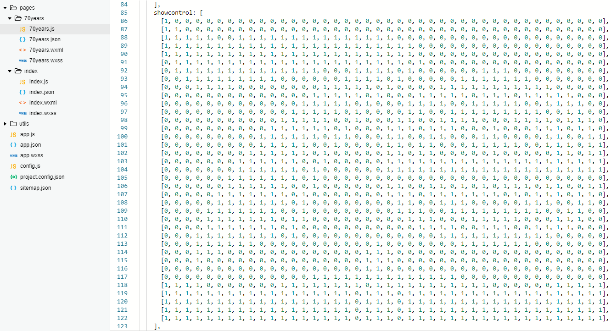
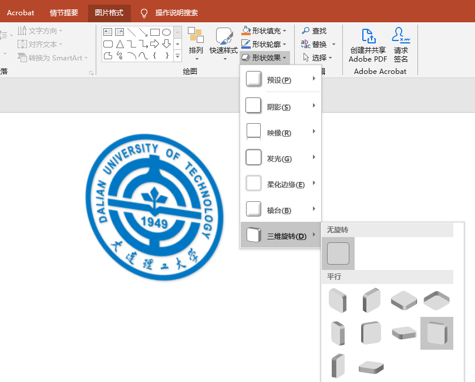

# 大连理工大学70周年校庆系列小程序之——相聚大工


## 项目简介


这是于:clock8:2019年6月15日（建校70周年纪念日）由“大连理工大学”官方微信公众号推送的**相聚大工**小程序，作为一个宣传性质的小程序，在发布后3天内获得了2.1万用户并被广泛转发到朋友圈，较好地完成了既定的任务:tada:


## 页面一览

### 欢迎页


早期版本的首页是左面这个推拉门动画:door::point_left::point_right::door:（由于“分裂大工”被捕，替换为右侧这个简单但更实用的点击->消失动画）

### 历史卷轴


一个纵向的卷轴:scroll:动画，用于展示大工的重要历史时刻并**为动画渲染赢得时间**:stuck_out_tongue_winking_eye:

### 头像拼图


此小程序的核心部分，一个将大量头像拼成校庆标志的动画，这些头像会从左往右进行拼接(当然，是可调的)，用户的头像会被明显的放大以增强其临场感:sunglasses:

点击“查看我的头像位置”按钮将能放大用户头像并将其点亮:sparkles:（绑定了一个css3动画），同时按钮将变换样式，点击后缩小头像，但闪光效果不消失

点击“生成分享图”字样将根据使用者头像和参与次序生成如下样式的图片：


（:warning:这里有一个人生的经验，虽然这个功能是生成图片分享到朋友圈，但如果写上“分享到朋友圈”字样，将会被判定为“诱导分享”，无法通过审核；这个问题导致之前的校史答题小程序屡次无法通过审核，摆事实、讲道理说明我们这是为教育事业做贡献的小程序，用户分享到朋友圈没有任何奖励也是不行的，最后删掉了这个按钮才通过，令人愤慨:anger:；但我明白了和审核员讲道理是没有用的，改个名就能解决的事，不要难为一个可编程过滤器）

---

## 

### 拼图形状


拼图的形状是通过`70years.js`中的`showcontrol`这个二位数组来控制的



下面这张图能直观的展现这个矩阵的微观-宏观结构


想要比较细腻的显示指定图形，矩阵大约要有2000~3000个成员，这个工作量难以手动完成（如果你是拼豆爱好者或者Minecraft资深玩家，可以试试），这里我使用的是matlab来完成这个工作，代码如下：

```matlab
tu=imread('46.png'); %读取图片
x=rgb2gray(tu); %将RGB图像或彩色图转换为灰度图像
subplot(221); %设置绘图位置
imshow(tu); %绘图
title('原图','fontsize',20); %设置标题
subplot(222); 
imshow(x); 
title('灰度图像','fontsize',20);
thresh1=graythresh(x);   
tu1 = imbinarize(x,thresh1); %图像二分阈值化
subplot(223);
imshow(tu1);
title('使用算法阈值','fontsize',20);
%使用最大类间方差法找到图片的一个合适的阈值
%thresh1=0.7039，出图不佳，手动设置为0.95
tu2 = imbinarize(x,0.95); %图像二分阈值化
subplot(224);
imshow(tu2);
title('手动指定阈值','fontsize',20);
csvwrite('0和1矩阵x.csv',tu2); 
%将矩阵以csv格式输出
```


这里需要注意两点：

> * 将图片进行处理前需将图片宽高都修改到50像素左右，不然矩阵过大会导致后期渲染动画的数量急剧增加，性能急剧下降
> * 由于我处理的这张图片缩小之后上部边缘有一些模糊，所以我没有采用OSTU方法给我的阈值而是自己指定了一个0.95作为阈值，这个值对于其他图片可能不是最佳的，使用时需注意修改代码

matlab程序运行之后就会得到一个`0和1矩阵x.csv`，里面就是这张图片的二值矩阵，但这个矩阵并不能直接粘贴到代码中使用，需要为每一行添加`[`和`]`，这里需要结合使用Excel的下拉复制功能和notepad++的`Ctrl+H`替换功能

### 拼图动画

拼图动画是使用微信小程序提供的`Animation API`来创建的，如果你没有接触过这个API，下面这个示例能告诉你它的基本作用


`Animation API`不光能创建单个动画，还能如上所示创建复合动画和动画队列，这是我们接下来要用到的，拼图动画的各项参数

#### 动画


### 小程序logo


首先，既然要把这个小程序用于你们的组织，那这个logo就得改改，如果你想获得我这种风格的logo，那就打开你的PPT8

首先，将你们组织的标志（透明背景格式）进行一个三维旋转，这里选择**离轴2：左**



然后，插入一个矩形，也进行一个三维旋转，但这里选择**离轴2：上**，最后，为它添加一个阴影，放到组织标志下面作为底座


最后，插入艺术字，写上名称，设置加粗和阴影，在“形状格式”栏中设置下文字轮廓，这样字形会更清晰，然后，也进行一个**离轴2：左**三维旋转，然后将艺术字放入底座，logo就完成了


------

## 什么是 Markdown

Markdown 是一种方便记忆、书写的纯文本标记语言，用户可以使用这些标记符号以最小的输入代价生成极富表现力的文档：譬如您正在阅读的这份文档。它使用简单的符号标记不同的标题，分割不同的段落，**粗体** 或者 *斜体* 某些文字，更棒的是，它还可以

### 1. 制作一份待办事宜 [Todo 列表](https://www.zybuluo.com/mdeditor?url=https://www.zybuluo.com/static/editor/md-help.markdown#13-待办事宜-todo-列表)

- [ ] 支持以 PDF 格式导出文稿
- [ ] 改进 Cmd 渲染算法，使用局部渲染技术提高渲染效率
- [x] 新增 Todo 列表功能
- [x] 修复 LaTex 公式渲染问题
- [x] 新增 LaTex 公式编号功能

### 2. 书写一个质能守恒公式[^LaTeX]

$$E=mc^2$$

### 3. 高亮一段代码[^code]

```python
@requires_authorization
class SomeClass:
    pass

if __name__ == '__main__':
    # A comment
    print 'hello world'
```

### 4. 高效绘制 [流程图](https://www.zybuluo.com/mdeditor?url=https://www.zybuluo.com/static/editor/md-help.markdown#7-流程图)

```flow
st=>start: Start
op=>operation: Your Operation
cond=>condition: Yes or No?
e=>end

st->op->cond
cond(yes)->e
cond(no)->op
```

### 5. 高效绘制 [序列图](https://www.zybuluo.com/mdeditor?url=https://www.zybuluo.com/static/editor/md-help.markdown#8-序列图)

```seq
Alice->Bob: Hello Bob, how are you?
Note right of Bob: Bob thinks
Bob-->Alice: I am good thanks!
```

### 6. 高效绘制 [甘特图](https://www.zybuluo.com/mdeditor?url=https://www.zybuluo.com/static/editor/md-help.markdown#9-甘特图)

```gantt
    title 项目开发流程
    section 项目确定
        需求分析       :a1, 2016-06-22, 3d
        可行性报告     :after a1, 5d
        概念验证       : 5d
    section 项目实施
        概要设计      :2016-07-05  , 5d
        详细设计      :2016-07-08, 10d
        编码          :2016-07-15, 10d
        测试          :2016-07-22, 5d
    section 发布验收
        发布: 2d
        验收: 3d
```

### 7. 绘制表格

| 项目   |   价格 | 数量  |
| ------ | -----: | :---: |
| 计算机 | \$1600 |   5   |
| 手机   |   \$12 |  12   |
| 管线   |    \$1 |  234  |

### 8. 更详细语法说明

想要查看更详细的语法说明，可以参考我们准备的 [Cmd Markdown 简明语法手册][1]，进阶用户可以参考 [Cmd Markdown 高阶语法手册][2] 了解更多高级功能。

总而言之，不同于其它 *所见即所得* 的编辑器：你只需使用键盘专注于书写文本内容，就可以生成印刷级的排版格式，省却在键盘和工具栏之间来回切换，调整内容和格式的麻烦。**Markdown 在流畅的书写和印刷级的阅读体验之间找到了平衡。** 目前它已经成为世界上最大的技术分享网站 GitHub 和 技术问答网站 StackOverFlow 的御用书写格式。

---

## 什么是 Cmd Markdown

您可以使用很多工具书写 Markdown，但是 Cmd Markdown 是这个星球上我们已知的、最好的 Markdown 工具——没有之一 ：）因为深信文字的力量，所以我们和你一样，对流畅书写，分享思想和知识，以及阅读体验有极致的追求，我们把对于这些诉求的回应整合在 Cmd Markdown，并且一次，两次，三次，乃至无数次地提升这个工具的体验，最终将它演化成一个 **编辑/发布/阅读** Markdown 的在线平台——您可以在任何地方，任何系统/设备上管理这里的文字。

### 1. 实时同步预览

我们将 Cmd Markdown 的主界面一分为二，左边为**编辑区**，右边为**预览区**，在编辑区的操作会实时地渲染到预览区方便查看最终的版面效果，并且如果你在其中一个区拖动滚动条，我们有一个巧妙的算法把另一个区的滚动条同步到等价的位置，超酷！

### 2. 编辑工具栏

也许您还是一个 Markdown 语法的新手，在您完全熟悉它之前，我们在 **编辑区** 的顶部放置了一个如下图所示的工具栏，您可以使用鼠标在工具栏上调整格式，不过我们仍旧鼓励你使用键盘标记格式，提高书写的流畅度。


### 3. 编辑模式

完全心无旁骛的方式编辑文字：点击 **编辑工具栏** 最右侧的拉伸按钮或者按下 `Ctrl + M`，将 Cmd Markdown 切换到独立的编辑模式，这是一个极度简洁的写作环境，所有可能会引起分心的元素都已经被挪除，超清爽！

### 4. 实时的云端文稿

为了保障数据安全，Cmd Markdown 会将您每一次击键的内容保存至云端，同时在 **编辑工具栏** 的最右侧提示 `已保存` 的字样。无需担心浏览器崩溃，机器掉电或者地震，海啸——在编辑的过程中随时关闭浏览器或者机器，下一次回到 Cmd Markdown 的时候继续写作。

### 5. 离线模式

在网络环境不稳定的情况下记录文字一样很安全！在您写作的时候，如果电脑突然失去网络连接，Cmd Markdown 会智能切换至离线模式，将您后续键入的文字保存在本地，直到网络恢复再将他们传送至云端，即使在网络恢复前关闭浏览器或者电脑，一样没有问题，等到下次开启 Cmd Markdown 的时候，她会提醒您将离线保存的文字传送至云端。简而言之，我们尽最大的努力保障您文字的安全。

### 6. 管理工具栏

为了便于管理您的文稿，在 **预览区** 的顶部放置了如下所示的 **管理工具栏**：


通过管理工具栏可以：

<i class="icon-share"></i> 发布：将当前的文稿生成固定链接，在网络上发布，分享
<i class="icon-file"></i> 新建：开始撰写一篇新的文稿
<i class="icon-trash"></i> 删除：删除当前的文稿
<i class="icon-cloud"></i> 导出：将当前的文稿转化为 Markdown 文本或者 Html 格式，并导出到本地
<i class="icon-reorder"></i> 列表：所有新增和过往的文稿都可以在这里查看、操作
<i class="icon-pencil"></i> 模式：切换 普通/Vim/Emacs 编辑模式

### 7. 阅读工具栏


通过 **预览区** 右上角的 **阅读工具栏**，可以查看当前文稿的目录并增强阅读体验。

工具栏上的五个图标依次为：

<i class="icon-list"></i> 目录：快速导航当前文稿的目录结构以跳转到感兴趣的段落
<i class="icon-chevron-sign-left"></i> 视图：互换左边编辑区和右边预览区的位置
<i class="icon-adjust"></i> 主题：内置了黑白两种模式的主题，试试 **黑色主题**，超炫！
<i class="icon-desktop"></i> 阅读：心无旁骛的阅读模式提供超一流的阅读体验
<i class="icon-fullscreen"></i> 全屏：简洁，简洁，再简洁，一个完全沉浸式的写作和阅读环境

### 8. 阅读模式

在 **阅读工具栏** 点击 <i class="icon-desktop"></i> 或者按下 `Ctrl+Alt+M` 随即进入独立的阅读模式界面，我们在版面渲染上的每一个细节：字体，字号，行间距，前背景色都倾注了大量的时间，努力提升阅读的体验和品质。

### 9. 标签、分类和搜索

在编辑区任意行首位置输入以下格式的文字可以标签当前文档：

标签： 未分类

标签以后的文稿在【文件列表】（Ctrl+Alt+F）里会按照标签分类，用户可以同时使用键盘或者鼠标浏览查看，或者在【文件列表】的搜索文本框内搜索标题关键字过滤文稿，如下图所示：


### 10. 文稿发布和分享

在您使用 Cmd Markdown 记录，创作，整理，阅读文稿的同时，我们不仅希望它是一个有力的工具，更希望您的思想和知识通过这个平台，连同优质的阅读体验，将他们分享给有相同志趣的人，进而鼓励更多的人来到这里记录分享他们的思想和知识，尝试点击 <i class="icon-share"></i> (Ctrl+Alt+P) 发布这份文档给好友吧！

------

再一次感谢您花费时间阅读这份欢迎稿，点击 <i class="icon-file"></i> (Ctrl+Alt+N) 开始撰写新的文稿吧！祝您在这里记录、阅读、分享愉快！

作者 [@ghosert][3]     
2016 年 07月 07日    

[^LaTeX]: 支持 **LaTeX** 编辑显示支持，例如：$\sum_{i=1}^n a_i=0$， 访问 [MathJax][4] 参考更多使用方法。

[^code]: 代码高亮功能支持包括 Java, Python, JavaScript 在内的，**四十一**种主流编程语言。

[1]: https://www.zybuluo.com/mdeditor?url=https://www.zybuluo.com/static/editor/md-help.markdown
[2]: https://www.zybuluo.com/mdeditor?url=https://www.zybuluo.com/static/editor/md-help.markdown#cmd-markdown-高阶语法手册
[3]: http://weibo.com/ghosert
[4]: http://meta.math.stackexchange.com/questions/5020/mathjax-basic-tutorial-and-quick-reference